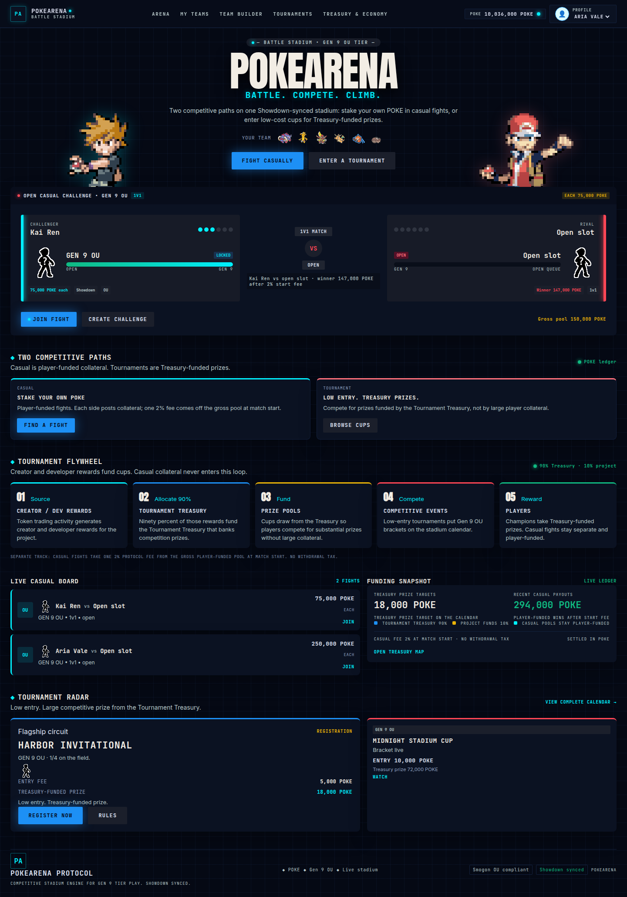

# PokeArena

PokeArena is a competitive Pokémon stadium for Generation 9 Overused. Stake POKE in player-funded casual fights, or enter low-cost cups for prizes funded by the Tournament Treasury. Battles are Showdown-synced: legal teams, legal choices, and one settlement when the fight ends.



The full walkthrough, with the Arena, team builder, live battle, brackets, and Treasury, is in the [product guide](docs/guide.md).

## Stadium

| Surface | What it is |
| --- | --- |
| Arena | Open casual challenges. Same collateral from both trainers, 2% protocol fee at match start, winner takes 98%. |
| Team builder | Gen 9 OU rosters, validated before they are brought to a fight or a cup. |
| Tournaments | Single-elimination cups. Small entry fee, Treasury-funded prize. |
| Treasury | Creator rewards route 90% to the Tournament Treasury and 10% to project operations. Casual collateral stays on its own route. |

Trainer profiles on the stadium are Aria Vale and Kai Ren. The header shows the active profile and the POKE balance.

## Run

```text
pnpm install
pnpm --filter @pokearena/battle-engine build
pnpm --filter @pokearena/tournament build
pnpm --filter @pokearena/api build
pnpm --filter @pokearena/api start
pnpm --filter @pokearena/web dev
```

Open `http://127.0.0.1:3001`.

Service boundaries are described in [docs/architecture.md](docs/architecture.md).
