# PokeArena

A shareable copy of this guide is in [PokeArena-Product-Guide.pdf](PokeArena-Product-Guide.pdf).

PokeArena is the competitive stadium for Generation 9 Overused. Trainers stake their own POKE in casual fights, or pay a small entry fee and play single-elimination cups for prizes funded by the Tournament Treasury. Every battle is Showdown-synced: teams are checked against the OU ruleset, only legal choices are accepted, and a finished fight settles once.


The header stays with you on every screen. It shows your POKE balance, the live connection, and the active trainer profile. Aria Vale and Kai Ren are the stadium profiles. Switch between them from the profile menu.

## Two ways to compete

Casual fights and tournaments share the stadium and the Gen 9 OU ruleset. They do not share money.

| Path | Who funds it | What you post | What the winner receives |
| --- | --- | --- | --- |
| Casual | The two trainers | The same collateral from each side | 98% of the gross pool |
| Tournament | The Tournament Treasury | A small entry fee | The Treasury prize for that cup |

Casual collateral never enters the Tournament Treasury. Creator and developer rewards do. Ninety percent of those rewards bank the Treasury that pays cup prizes. Ten percent stays with the project for stadium operations.

## Casual fights

Open the Arena to see every challenge on the board. Each card shows the challenger, the format, the collateral each trainer must post, the gross pool, and the winner’s payout after the start fee.

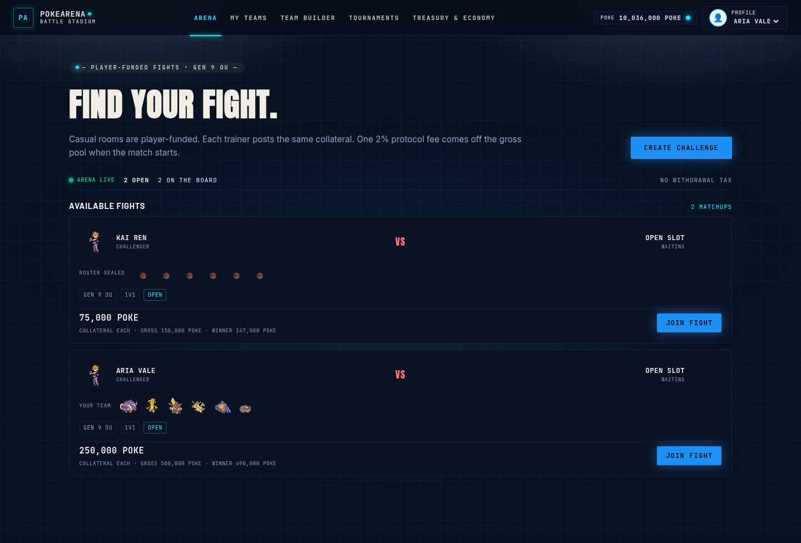

The casual lobby is the same board with your active challenges and recent results beside it.

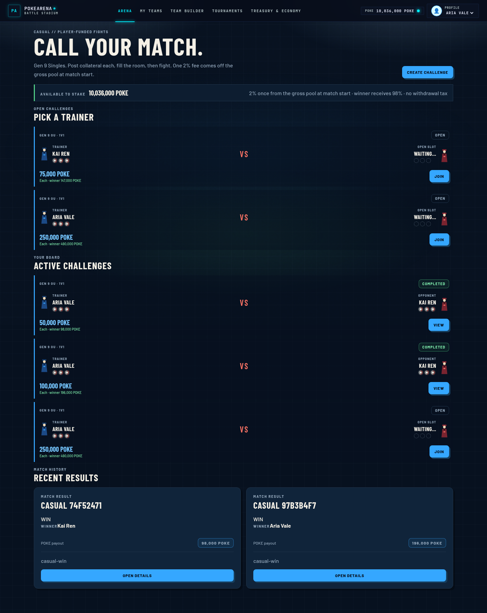

### Call a challenge

Create a challenge to set the stake before anyone joins.

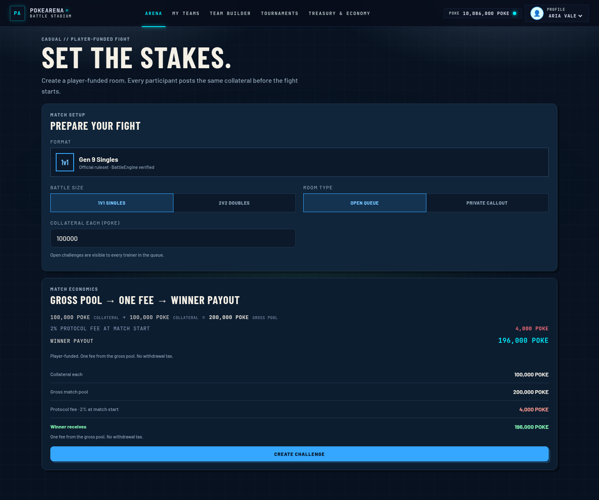

- Format is Gen 9 OU singles.
- Open challenges appear on the Arena for any trainer.
- Private callouts go only to the trainer you invite.
- Both trainers post the same collateral. The gross pool is that amount twice.
- A 2% protocol fee is taken once, from the gross pool, when the match starts. There is no withdrawal tax.
- The winner receives the remaining 98%.

Example at 100,000 POKE each: the gross pool is 200,000 POKE, the protocol fee is 4,000 POKE, and the winner receives 196,000 POKE.

### The lobby

The room lobby is where both trainers lock in. Your saved Gen 9 OU team is shown before you ready up. The room code can be copied for a rival, and the economics stay visible until the fight starts.

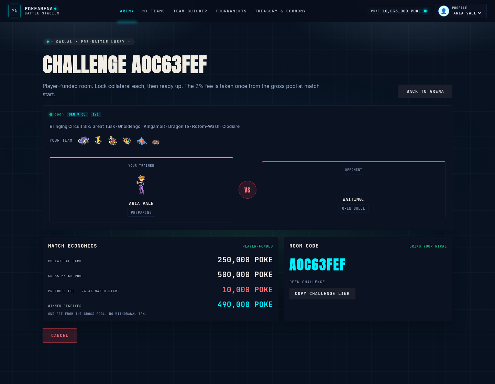

When both trainers are ready, either one can start the battle. Collateral is committed at the start, and the protocol fee is charged at that moment.

### The fight

The battle screen is the Showdown client, bound to your trainer. Team preview comes first. Confirm the lead order, then play the fight with the moves and switches the position allows. The bar above the field shows the rival, the stake, and the pot.

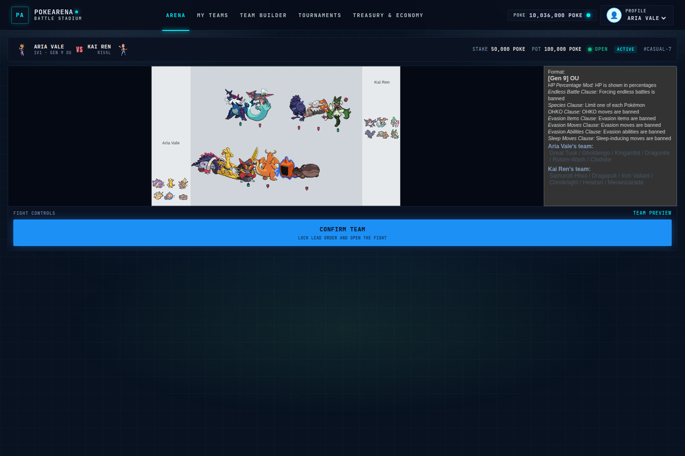

Leaving the battle tab does not end the fight. The stadium keeps a rejoin banner until the match is decided or you forfeit. A forfeit awards the fight to the rival.

### The result

Finished fights land on a result card. The winner is credited in POKE. The ledger shows the reason, the format, and the 2% protocol fee.

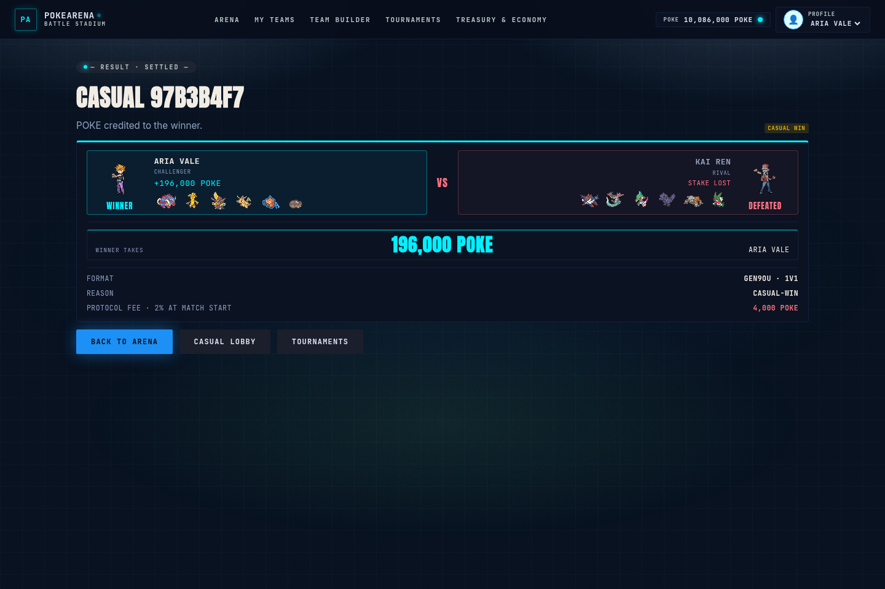

## Teams

Each trainer profile keeps a Gen 9 OU roster. My Teams shows the six slots, the team name, and whether the paste passes the ruleset.

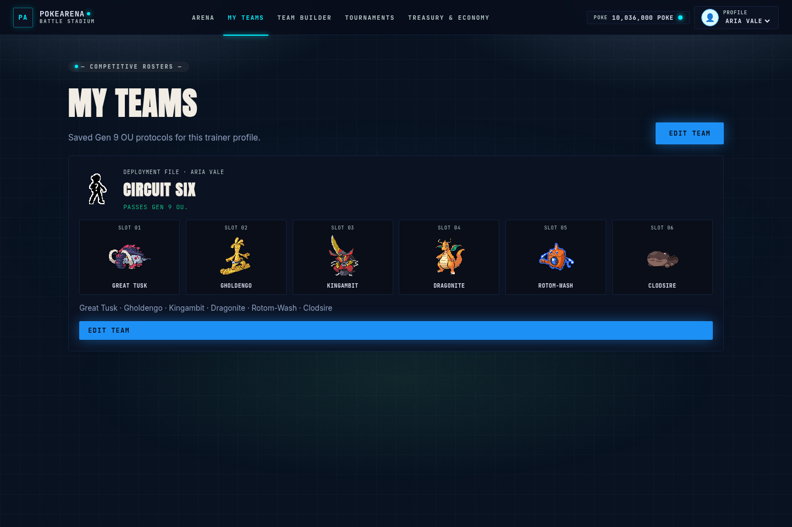

The team builder is the editor. It loads the saved protocol, validates it against Gen 9 OU, and shows species, items, abilities, Tera types, moves, EVs, and the defensive profile of the six. Save the protocol on this browser, then bring it to a casual ready-up or a tournament registration.

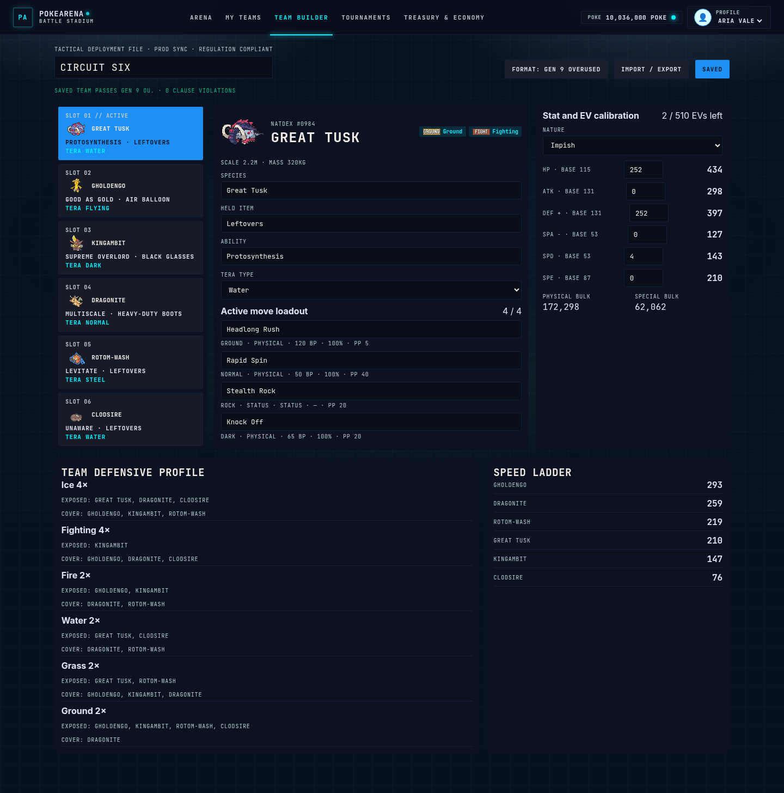

A paste that does not pass Gen 9 OU can still be saved as a draft. A match brings the circuit roster until the draft is legal.

## Tournaments

Cups are not collateral wagers. You pay the entry fee and compete for a Treasury prize.

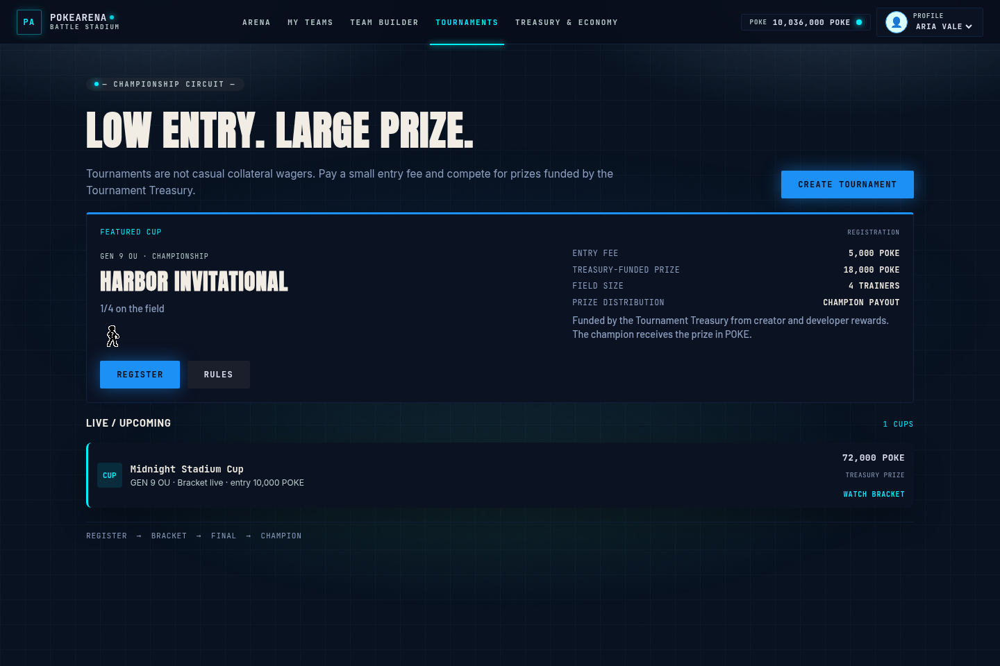

The calendar leads with the featured cup and lists the rest of the circuit. Harbor Invitational is open for registration at 5,000 POKE, with an 18,000 POKE Treasury prize. Midnight Stadium Cup is already on the bracket.

Open a cup to register, or to watch the bracket once it is live. Registration uses your saved team. When the field is set, the cup starts as a single-elimination bracket. Your match has an Enter control that opens the same battle screen as a casual fight.

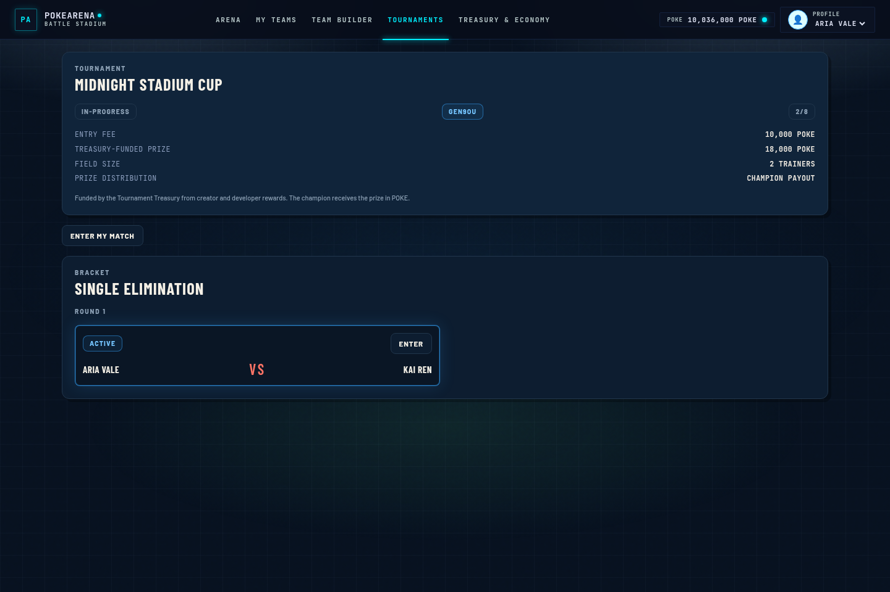

The champion receives the Treasury prize for that cup. A finished cup shows the champion and the settled result.

## Treasury and economy

Treasury & Economy is the funding map. It keeps the two routes separate.

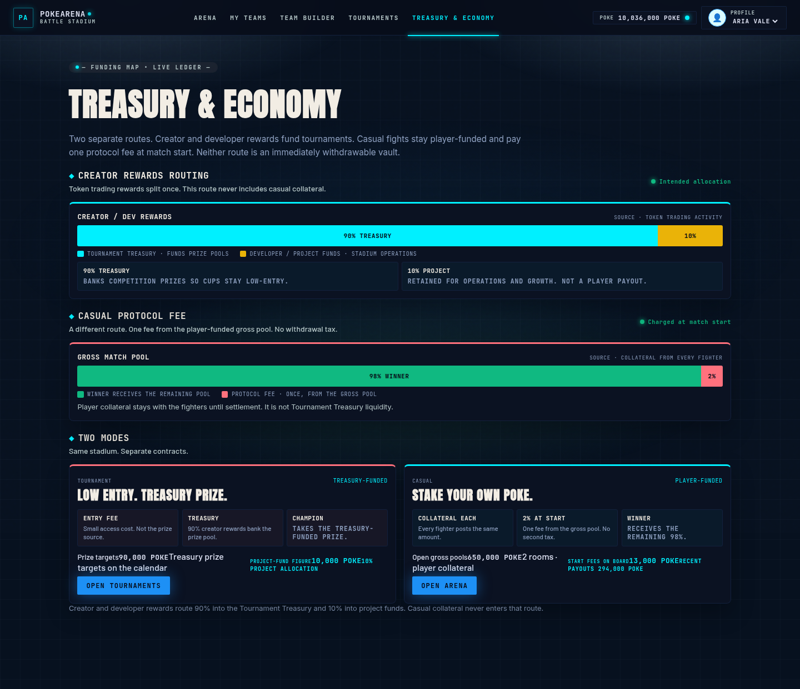

**Creator rewards.** Token trading activity produces creator and developer rewards. That stream is split once:

- 90% goes to the Tournament Treasury and banks cup prizes, so events can stay low-entry.
- 10% stays with the project for operations and growth. It is not a player payout.

**Casual protocol fee.** This route never touches the Treasury. Each fighter posts collateral. At match start, 2% of the gross pool is the protocol fee and the winner receives the other 98%. Open pools and recent payouts are shown from the fights currently on the stadium.

## Run the stadium

From the repository root, with pnpm:

```text
pnpm install
pnpm --filter @pokearena/battle-engine build
pnpm --filter @pokearena/tournament build
pnpm --filter @pokearena/api build
pnpm --filter @pokearena/api start
pnpm --filter @pokearena/web dev
```

The API listens on `http://127.0.0.1:3000`. The stadium UI listens on `http://127.0.0.1:3001`.

Sign in with Aria Vale or Kai Ren from the profile menu. Build a team, post a casual challenge, or register for the cup on the calendar.
